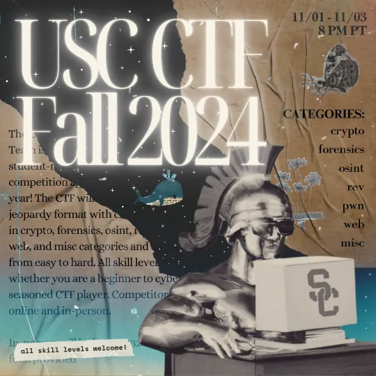

# USC CTF Fall 2024

Write-ups and source code repository for USC CTF Fall 2024

CTFTime: [https://ctftime.org/event/2543](https://ctftime.org/event/2543)

Discord: [https://discord.gg/U7jdtfeXWv](https://discord.gg/U7jdtfeXWv)

The writeups for each challenge are in the README.md file for the corresponding challenge folder.

## Running server apps for challenges

To practice solving the web or pwn challenges, navigate to the `server` folder for a challenge. Build the Docker image on your computer and run a container locally. All of the Docker containers expose port 5000.

Example:
```
> cd "web/Tommy's Artventures/server"
> docker build -t tommy .
[+] Building 10.3s (10/10) FINISHED                                                                    docker:default
 => [internal] load build definition from Dockerfile                                                             0.1s
 => => transferring dockerfile: 222B                                                                             0.0s
 => [internal] load metadata for docker.io/library/python:3-alpine                                               2.4s
...
> docker run --rm --publish 5000:5000 tommy
```

Access web challenges at http://localhost:5000 or pwn challenges with the command `nc localhost 5000`.

