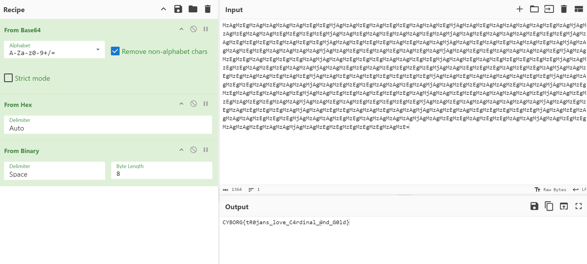

# colors (crypto)

challenge author: ldbwls

category: beginner crypto

writeup author: neonlian

## Solution

Copy the message into CyberChef. The message is Base64 encoded, as indicated by the equals sign `=` at the end of the message which is 
commonly used as padding for Base64 strings. Add a "From Base64" layer to reveal the next part of the message:

```
30 31 30 30 30 30 31 31 20 30 31 30 31 31 30 30 31 20 30 31 30 30 30 30 31 30 20 30 31 30 30 31 31 31 31 20 30 31 30 31 30 30 31 30 20 30 31 30 30 30 31 31 31 20 30 31 31 31 31 30 31 31 20 30 31 31 31 30 31 30 30 20 30 31 30 31 30 30 31 30 20 30 30 31 31 30 30 30 30 20 30 31 31 30 31 30 31 30 20 30 31 31 30 30 30 30 31 20 30 31 31 30 31 31 31 30 20 30 31 31 31 30 30 31 31 20 30 31 30 31 31 31 31 31 20 30 31 31 30 31 31 30 30 20 30 31 31 30 31 31 31 31 20 30 31 31 31 30 31 31 30 20 30 31 31 30 30 31 30 31 20 30 31 30 31 31 31 31 31 20 30 31 30 30 30 30 31 31 20 30 30 31 31 30 31 30 30 20 30 31 31 31 30 30 31 30 20 30 31 31 30 30 31 30 30 20 30 31 31 30 31 30 30 31 20 30 31 31 30 31 31 31 30 20 30 31 31 30 30 30 30 31 20 30 31 31 30 31 31 30 30 20 30 31 30 31 31 31 31 31 20 30 31 30 30 30 30 30 30 20 30 31 31 30 31 31 31 30 20 30 31 31 30 30 31 30 30 20 30 31 30 31 31 31 31 31 20 30 31 30 30 30 31 31 31 20 30 30 31 31 30 30 30 30 20 30 31 31 30 31 31 30 30 20 30 31 31 30 30 31 30 30 20 30 31 31 31 31 31 30 31
```

Common number bases used in cryptography challenges include decimal, binary, hexadecimal, octal, and base 64. This cannot be binary because
there are digits greater than 1. Of the remaining bases, only hexadecimal gives valid output. Add a "From Hex" layer to reveal the next part of the message:

```
01000011 01011001 01000010 01001111 01010010 01000111 01111011 01110100 01010010 00110000 01101010 01100001 01101110 01110011 01011111 01101100 01101111 01110110 01100101 01011111 01000011 00110100 01110010 01100100 01101001 01101110 01100001 01101100 01011111 01000000 01101110 01100100 01011111 01000111 00110000 01101100 01100100 01111101
```

This is all zeros and ones, which is binary. Add a "From Binary" layer to reveal the flag:

