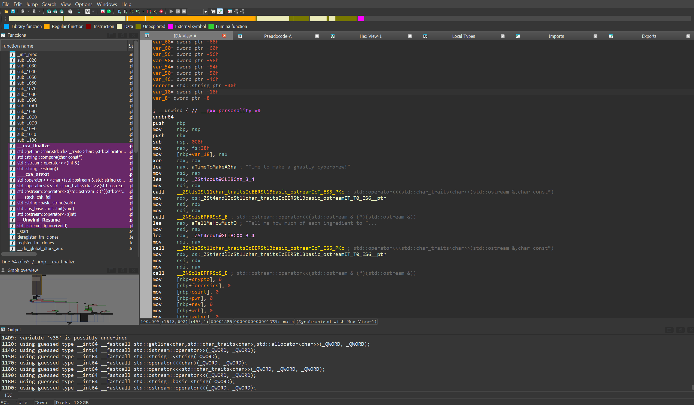
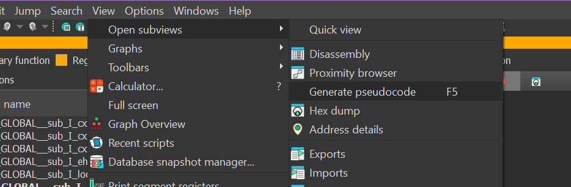
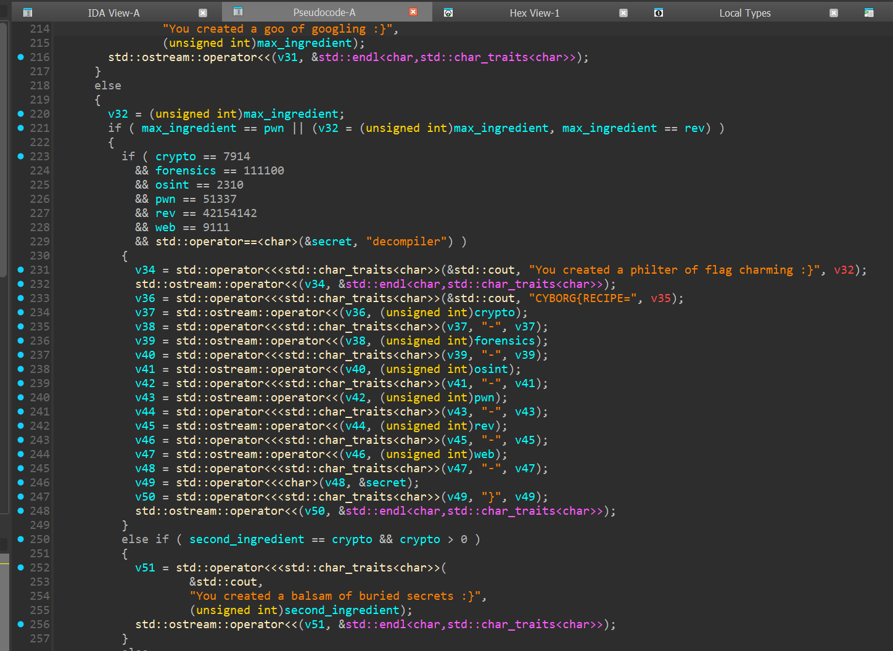

# concoction (rev)

Author: neonlian

Category: beginner rev

## Solution

Running the program will prompt you with asking for several quantities of ingredients and one secret ingredient. To get the flag, you need to find which inputs will output the flag by looking inside the executable.

### Route 1: Use a decompiler

Open the binary in a decompiler of your choice. For this writeup I will analyze the original upload of the Linux executable (now labeled `concoction_old` on the challenge) in IDA Free. Other good reverse engineering tools are Ghidra and Binary Ninja. Make sure to import the debugging information if your reverse engineering tool allows you to.



When you first open the binary you will be greeted with this disassembly code and a list of function names on the left. You should see some fragments of the program in the code, such as the strings that are prompted to the user ("Time to make a ghastly cyberbrew!").

It's hard to tell what is going on by reading the assembly though, so decompile the assembly by going to `View > Open subviews > Generate pseudocode (F5)`.



After generating the pseudocode, you should see the main() function with many variables listed on the top and the program's code down below. It is much more verbose than regular C++ syntax, but you should be able to see where the cout statements are that print the prompts. 

Scroll down until you see this if statement:


You can tell that when this if statement's condition is true, it will output the flag because one of the cout statements includes "CYBORG{" in it. From the if statement, you can see the numbers you need to input into the program to get the flag (7914, 111100, 2310, 51337, 42154142, 9111) and the secret ingredient ("decompiler"). Rerun the program and enter these inputs to get the flag. Note that you do not need to enter a specific number for the amount of water, but it needs to be a positive number or else you will create a salad.

If the numbers appear in your program with a `0x` prefix or an `h` suffix, that means the numbers are in hexadecimal. Use a hexadecimal to decimal converter to find the numbers in base 10 that you need to input into the program.

```
Time to make a ghastly cyberbrew!
Tell me how much of each ingredient to put in.
How many crypto crickets? (int)
7914
How many forensics fungi? (int)
111100
How many osint oreos? (int)
2310
How many plants of pwn? (int)
51337
How many rev redcaps? (int)
42154142
How many cobwebs? (int)
9111
How many ounces of water? (int)
10
What secret ingredient? (string)
decompiler
You created a philter of flag charming :}
CYBORG{RECIPE=7914-111100-2310-51337-42154142-9111-decompiler}
```


### Route 2: Print the source code using debugging symbols

Run the `file` command (on Linux) to get information about the executable:

```
> file ./concoction_old
./concoction_old: ELF 64-bit LSB pie executable, x86-64, version 1 (SYSV), dynamically linked, interpreter /lib64/ld-linux-x86-64.so.2, BuildID[sha1]=ce567aa6f3003896dcff81a7d3793f57eee1e46d, for GNU/Linux 3.2.0, with debug_info, not stripped
```

Note that the program is compiled `with debug_info`. This means that the executable contains all the names of functions and variables, which is useful when debugging a program but also makes reverse engineering very easy. Using GDB you can print the entire source code of an executable with debug info included.

Run the program using the GDB:
```
> gdb ./concoction_old
GNU gdb (Ubuntu 12.1-0ubuntu1~22.04.2) 12.1
Copyright (C) 2022 Free Software Foundation, Inc.
License GPLv3+: GNU GPL version 3 or later <http://gnu.org/licenses/gpl.html>
This is free software: you are free to change and redistribute it.
There is NO WARRANTY, to the extent permitted by law.
Type "show copying" and "show warranty" for details.
This GDB was configured as "x86_64-linux-gnu".
Type "show configuration" for configuration details.
For bug reporting instructions, please see:
<https://www.gnu.org/software/gdb/bugs/>.
Find the GDB manual and other documentation resources online at:
    <http://www.gnu.org/software/gdb/documentation/>.

For help, type "help".
Type "apropos word" to search for commands related to "word"...
Reading symbols from ./concoction_old...
(gdb)
```

By default, gdb will list 10 lines of code at a time. Run this to show all the code at once:
```
(gdb) set listsize 1000
```

Then list the code of the main function:
```
(gdb) list main
```

This should print out the original C++ source code. On line 64 you can see the if statement checking for the flag condition:
```c++
63          } else if (max_ingredient == pwn || max_ingredient == rev) {
64              if (crypto == 7914 && forensics == 111100 && osint == 2310 && pwn == 51337 && rev == 42154142 && web == 9111 && secret == "decompiler") {
65                  cout << "You created a philter of flag charming :}" << endl;
66                  cout << "CYBORG{RECIPE=" << crypto << "-" << forensics << "-" << osint << "-" << pwn << "-" << rev << "-" << web << "-" << secret << "}" << endl;
67              } else if (second_ingredient == crypto && crypto > 0) {
68                  cout << "You created a balsam of buried secrets :}" << endl;
69              } else {
70                  cout << "You created a salve of shattered secrets :}" << endl;
71              }
72          } else if (max_ingredient == web) {
```

While this route is easier than using a reverse engineering tool / decompiler, it will not work for most reverse engineering challenges because debugging information is rarely included. If you're new to rev I recommend going through Route 1 to get a basic understanding of how to navigate a reverse engineering tool.

## A note about static linking

Executables can be compiled using 'static linking', which makes an executable self-sufficient by including all libraries needed within the executable itself. This increases the binary size greatly but makes it easier to run on other machines. I initially compiled the Windows executable with static linking because another organizer couldn't run the dynamically linked executable during playtesting. For the Linux executable, the executable attached at the beginning of the competition was dynamically linked but when we received support tickets that people could not run the linux executable I renamed the existing executable to `concoction_old` and uploaded a statically linked version `concoction`. 

When writing up this solution walkthrough I realized that the statically linked executables are much more difficult to navigate than the dynamically linked counterpart. Thus, I apologize if anybody struggled with this challenge who downloaded the executable later in the competition, or attempted to analyze the Windows executable without looking at the Linux one.
