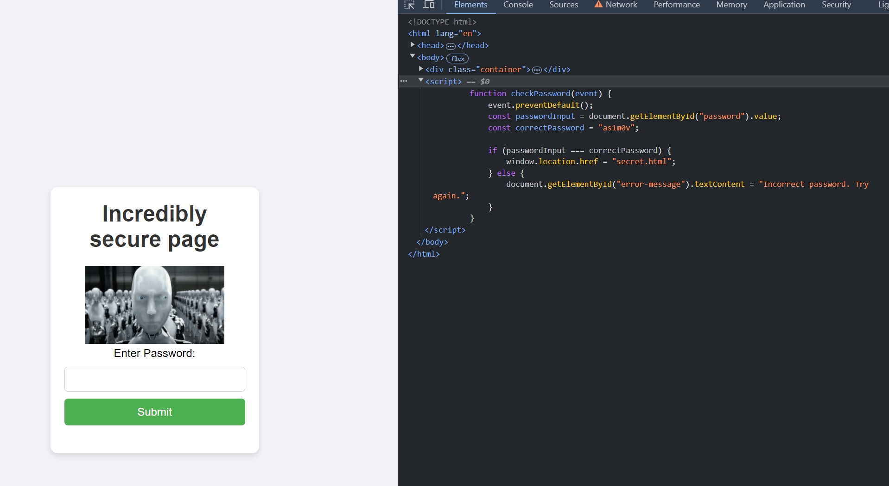

# iRobots (web)

challenge author: iblack21

category: web

writeup author: neonlian

## Solution

Inspecting the HTML code will reveal a Javascript function that checks for the password.



The password revealed in the script is `as1m0v`. Enter the password on the page to get sent to /secret.html.

You'll be greeted with this:

> Congrats! You've found the secret page. But you may have got here because a web scraper found this page first and let your favorite search engine know. Luckily our flag won't appear on your search engine :D

This, along with the challenge name, is a hint that you should check the `robots.txt` file on the webpage. `robots.txt` lists paths that a website doesn't want web scraping bots to enumerate, like the scrapers used to populate search engine results. Scrapers from legitimate
companies will often respect `robots.txt`, but anyone can view `robots.txt`. Sometimes `robots.txt` contains sensitive URL paths, given
that the website doesn't want those paths to be easily found in web searches.

Go to `/robots.txt` to see:
```
User-agent: *
Disallow: /hidden/flag.txt
```

Then, go to `/hidden/flag.txt` to find the flag.