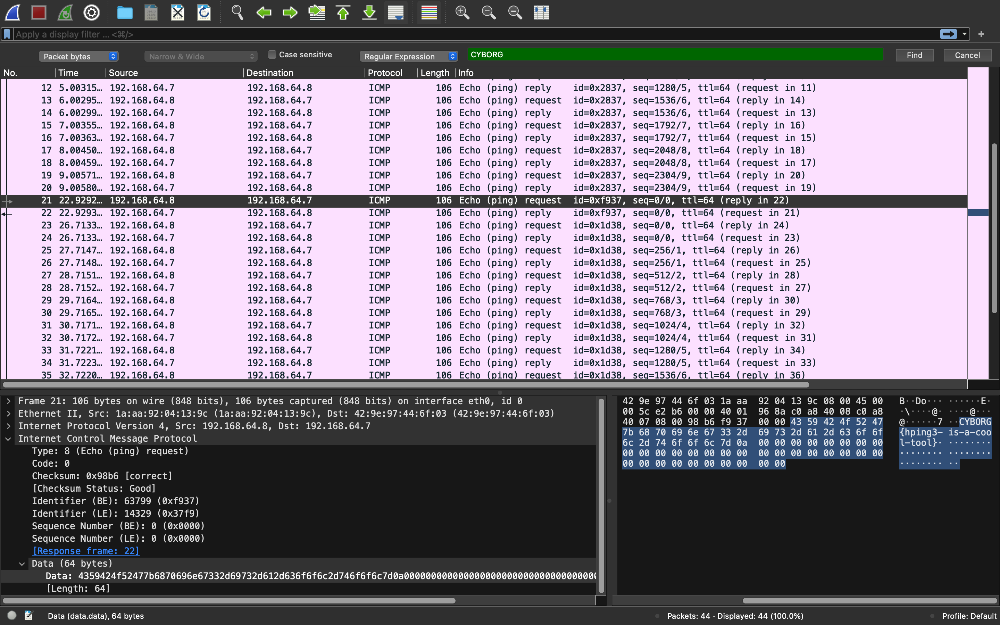

# Writeup for weirdtraffic

author: sophisticated.space
category: beginner (forensics)

## Step 1
Open the .pcapng in Wireshark by double-clicking the file. (Install Wireshark if you haven't)

## Step 2
Search for the flag. Ctrl + F >> set to "Packet Bytes" and "Regular Expression" >> type in the search bar "CYBORG"

## Step 3
Read the flag in the packet bytes

