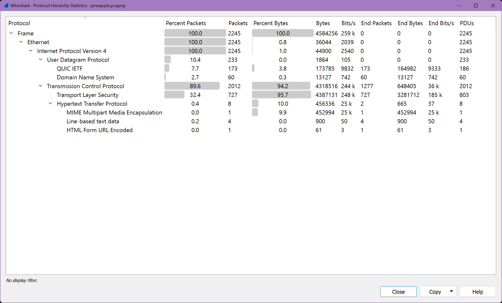
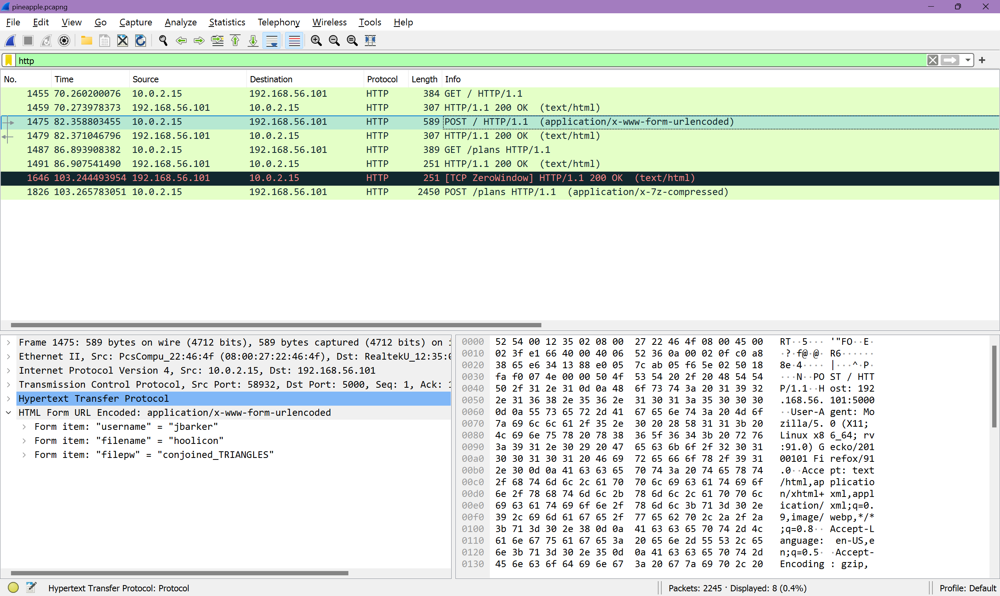
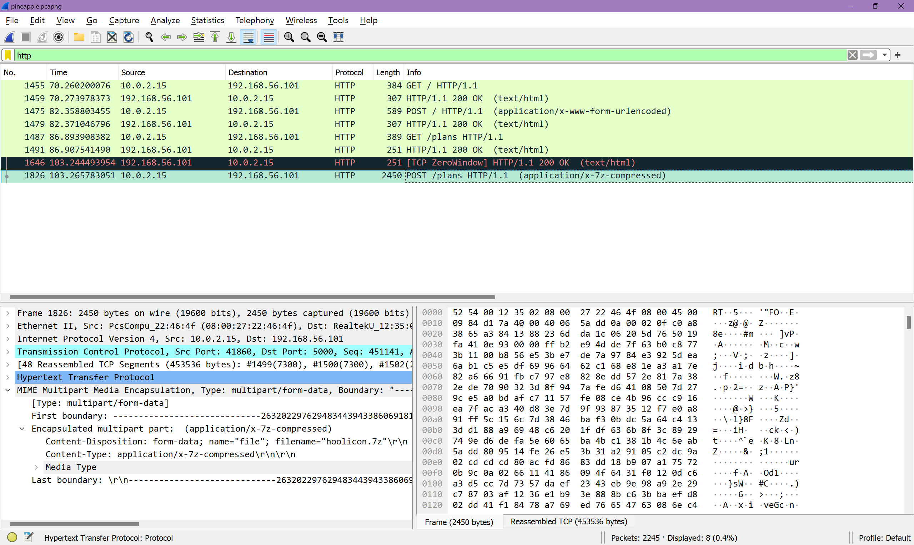
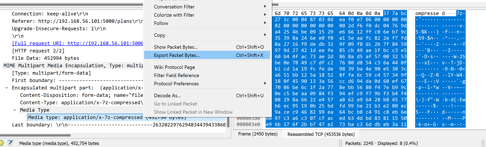

# pineapple

author: neonlian

category: forensics

## Solution

Open the .pcapng file in Wireshark. Look at Statistics > Protocol Hierarchy to get a summary of what's in the capture.

The QUIC IETF and TLS packets are encrypted, so it would be difficult to find the data sent through those protocols.

Filtering the packet list by `dns` (Domain Name System) reveals what websites were accessed in the capture. It turns out that all of the websites that appear in the DNS list have only encrypted data sent, so there is not much to find.

Filtering the packet list by `http` (Hypertext Transfer Protocol) reveals the key packets needed to solve the challenge.

The first POST request contains a username, filename, and filepw submitted through an HTTP form.

The filepw of "conjoined_TRIANGLES" does not have the CYBORG{} format, so it is not the flag. However, it will be useful in just a moment.

The second POST request contains a 7z compressed file named `hoolicon.7z`.

Some common mistakes when extracting the file include:
* Exporting the entire packet data (such as through File > Export Objects) will include the HTTP headers and not just the 7z, which will give you a "file corrupted" error when trying to decompress the file.
* Copying the packet data as ASCII can cause an error because 7z compressed files are binary files that can have byte values outside of the range visible as ASCII. 

To extract the 7z file, expand the MIME dropdown until you get to Media Type. Then, right click and choose Export Packet Bytes.

Save the file with a .7z extension, and extract the file using a tool like 7Zip or p7zip. When prompted for a password, enter the `conjoined_TRIANGLES` password found earlier.

Inside is a picture `flagimg.png` that shows the flag `CYBORG{pe4cefaRe_4x09}`.