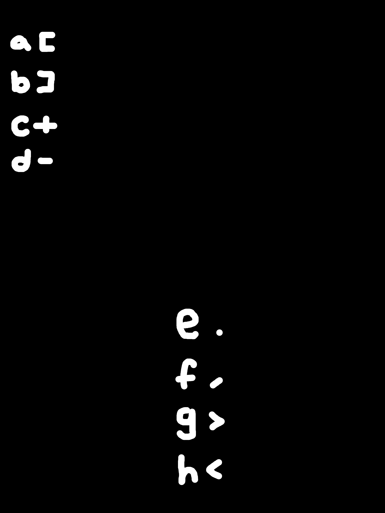

# Redwoods

Author: neonlian

Category: misc

## Solution

You are given a .jar file that has a text adventure inside. 

### Part 1: Gain the squirrel's wisdom

If you run the .jar and explore all the options, you should be able to talk to the squirrel. In the adventure game, you need to first climb the tree and gain a whole new perspective before venturing into the woods and offering trail mix.

Sequence: `1 1 2 2 1 1 1 3`

Squirrel chatter:
```
ccccccccccagccccccchdbgdddehcccccagcccchdbgccehcccccagddddhdbgdddehgcccccccccccccecccedddddddd
dddeagcgchhdbcccccagcccccccccchdbgccegcedddeddddeccccccccccccccccceddddddddddddddehhccccccaggccccchhdbggdddeddddddddddde
ddehhccccccaggdddddhhdbggdeehhcccccccccccaggcccchhdbggehhcccccaggdddddhhdbggeagcgchhdbabccccccaggdddhhdbggehcccccceehhcce
```

Alternatively, you can use a reverse engineering tool to find these strings in the program.

### Part 2: Find the symbol mapping

.jar files have the same format / structure as .zip files. If you rename the file to a zip and extract the file, you will find a hidden image:
```
> cp redwoods_meditation.jar redwoods.zip
> unzip redwoods.zip -d redwoods
Archive:  redwoods.zip
  inflating: redwoods/META-INF/MANIFEST.MF
  inflating: redwoods/Main.class
  inflating: redwoods/mistywoods.png
> ls redwoods
META-INF  Main.class  mistywoods.png
```

This is what mistywoods.png looks like:


Note that the picture is very bluegreen. This is a clue that there is hidden data on the red channel of the RGB data. Use a tool like [Aperi'Solve](https://www.aperisolve.com/) to show the red channel.



Note that the non-zero red values are very small (single digit), so if you're not able to see the letters and symbols then you may need to 'multiply' the red values in an image editing program.

### Part 3: Get the flag

We have these strings:
```
ccccccccccagccccccchdbgdddehcccccagcccchdbgccehcccccagddddhdbgdddehgcccccccccccccecccedddddddd
dddeagcgchhdbcccccagcccccccccchdbgccegcedddeddddeccccccccccccccccceddddddddddddddehhccccccaggccccchhdbggdddeddddddddddde
ddehhccccccaggdddddhhdbggdeehhcccccccccccaggcccchhdbggehhcccccaggdddddhhdbggeagcgchhdbabccccccaggdddhhdbggehcccccceehhcce
```

And this mapping:
```
a [
b ]
c +
d -
e .
f ,
g >
h <
```

If you replace each letter in the squirrel strings with the corresponding symbol, you'll get this:
```
++++++++++[>+++++++<-]>---.<+++++[>++++<-]>++.<+++++[>----<-]>---.<>+++++++++++++.+++.--------
---.[>+>+<<-]+++++[>++++++++++<-]>++.>+.---.----.+++++++++++++++++.--------------.<<++++++[>>+++++<<-]>>---.-----------.
--.<<++++++[>>-----<<-]>>-..<<+++++++++++[>>++++<<-]>>.<<+++++[>>-----<<-]>>.[>+>+<<-][]++++++[>>---<<-]>>.<++++++..<<++.
```

This is code for an esoteric programming language called Brainfuck. If you've never seen this language before, you could use [dcode.fr's cipher identifier](https://dcode.fr/cipher-identifier) to identify it.

Run the code in a [Brainfuck interpreter](https://www.dcode.fr/brainfuck-language) to get the flag.

```
CYBORG{HEARD_TR33_F4LL}
```