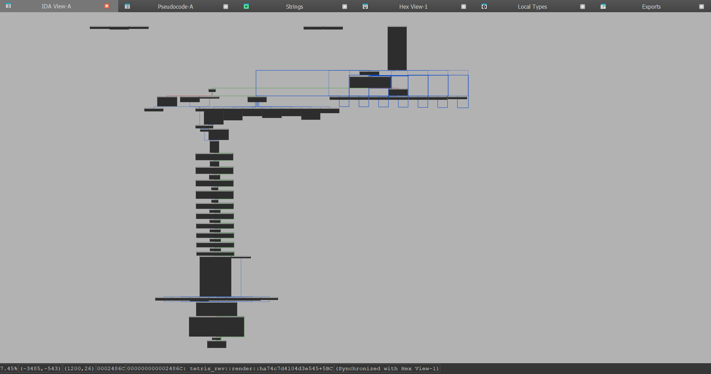
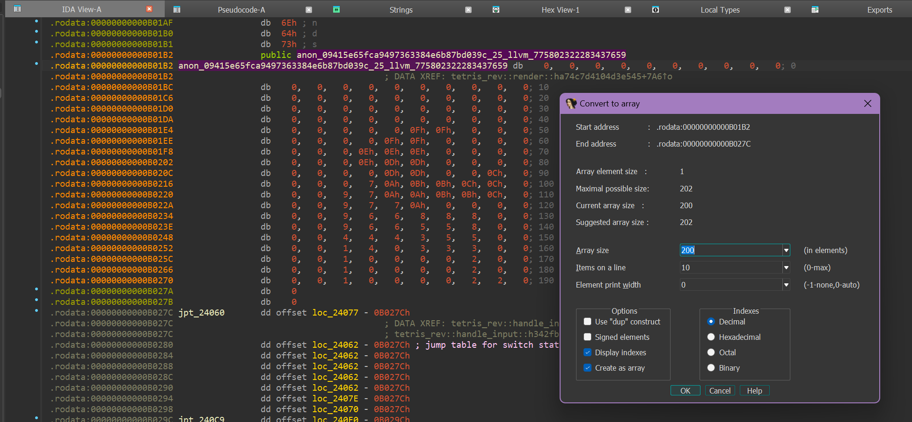

# Authentic Stacker

author: neonlian

category: rev

## Solution

This solution will use IDA Free and analyze the linux executable. 

`stacker_rev` is a Rust executable that runs a familiar puzzle game when opened.

## Part 1: finding the render function

Finding the game logic code using the method described in the Basic Rust Rev solution won't work because only the `macroquad::Window::new` 
function is called inside `tetris_rev::main`, which does not lead to the game code when exploring in the decompiler.

Instead, looking at the function list is a more productive way to find the relevant code.


The game-specific functions are under the tetris_rev namespace, notably `main`, `render`, `handle_input`, `Game::new`, and `Game::place_piece`. The most important one is the `render` function.

An alternative way to find the `render` function is to search the program strings for 'CYBORG', which has an XREF to the `render` function
because ultimately the `render` function is what prints the flag.

## Part 2: finding the key comparison check

IDA's decompiler has trouble with the `render` function, showing a JUMPOUT before the function truly finishes. 


However, looking at the `render` function in the graph view gives a sense of the function's control flow and contains the entire function
(in assembly, not C):



Despite being in assembly, it isn't *too* difficult to get an idea of what each part does because of the named calls to functions like
`macroquad::shapes::draw_rectangle` and `macroquad::text::draw_text_ex`. 

These two blocks of instructions are the critical ones for finding the flag:


The second block is suspicious for printing a flag, because it loads the `CYBORG{}` flag format string with the `lea rax, off_F1488` 
instruction and formats a string before calling `macroquad::text::draw_text_ex`. 

In order for the second block of instructions to run, it needs to pass a `bcmp` comparison in the previous instruction block. 
```
lea     rdi, [r13+108h] ; s1
lea     rsi, anon_09415e65fca9497363384e6b87bd039c_25_llvm_775802322283437659 ; s2
mov     edx, 0C8h       ; n
call    cs:bcmp_ptr
test    eax, eax
jnz     loc_24B5E
```

The `bcmp` call is comparing an array in memory starting at `r13+0x108` (that is loaded into `rdi`) with a hardcoded array in the binary designated by IDA as `anon_09415e65fca9497363384e6b87bd039c_25_llvm_775802322283437659`. The arrays are length 200, as indicated by the `mov edx, 0C8h` instruction (0xC8 = 200) passing in the third parameter to `bcmp`. 

## Part 3: Completing the puzzle

To get more information about the comparison being made, you can use GDB. Setting a breakpoint at the `bcmp` is not completely 
straightforward because the addresses that the functions are placed in memory do not correspond exactly to the addresses listed by
IDA. 

To find the address of the `bcmp` instruction call, we first find the offset listed by IDA:


Clicking on the 'call' line shows that the instruction is on address 0x24A62 in the binary.

Next, we find the instruction address listed for the `render` function in IDA:


IDA shows the `render` function starting at address 0x242B0. 

> Note: for the next part in GDB, you may need to disable address space layout randomization (ASLR) on your machine / on the virtual machine
> you are using.

Now, with GDB open, we can find the memory address that the start of the `render` function is placed at.
```
> gdb ./stacker_rev
(gdb) start
(gdb) info functions tetris_rev
All functions matching regular expression "tetris_rev":

Non-debugging symbols:
0x000055555556d760  core::ptr::drop_in_place<tetris_rev::game::Game>
0x000055555556df10  core::ptr::drop_in_place<tetris_rev::amain::{{closure}}>
0x0000555555570b50  tetris_rev::amain::{{closure}}
0x0000555555570e00  core::ptr::drop_in_place<tetris_rev::game::Game>
0x0000555555571440  core::ptr::drop_in_place<tetris_rev::amain::{{closure}}>
0x0000555555573a90  tetris_rev::amain::{{closure}}
0x0000555555576a60  core::ptr::drop_in_place<core::option::Option<macroquad::Window::from_config<macroquad::conf::Conf,tetris_rev::amain::{{closure}}>::{{closure}}>>
0x0000555555576ed0  tetris_rev::game::Game::new
0x0000555555577220  tetris_rev::game::Game::place_piece
0x0000555555577fd0  tetris_rev::handle_input
0x00005555555782b0  tetris_rev::render
0x0000555555578c60  tetris_rev::main
0x0000555555579cd0  tetris_rev::piece::PieceInfo::id
0x000055555557a400  core::ptr::drop_in_place<tetris_rev::amain::{{closure}}>
```

In this case, `render` is placed at address `0x00005555555782b0`, which is `0x555555554000` greater than the address listed by IDA. 
We can use this offset to set a breakpoint on the `bcmp` instruction. (I've also included commands to show the current assembly instructions
to help verify that the breakpoint is correct.)
```
(gdb) set disassembly-flavor intel
(gdb) b *(0x555555554000 + 0x24A62)
Breakpoint 2 at 0x555555578a62
(gdb) continue
Continuing.
[New Thread 0x7fffc5524640 (LWP 810)]

Thread 1 "stacker_rev" hit Breakpoint 2, 0x0000555555578a62 in tetris_rev::render ()
(gdb) display/i $pc
3: x/i $pc
=> 0x555555578a62 <_ZN10tetris_rev6render17ha74c7d4104d3e545E+1970>:    call   QWORD PTR [rip+0xd2fc8]        # 0x55555564ba30
```

You can also use `layout asm` to view the surrounding assembly instructions.

To print the current state of the array being compared, as a 200 byte array:
```
(gdb) display/200ub $rdi
1: x/200ub $rdi
0x555555e4be88: 0       0       0       0       0       0       0       0
0x555555e4be90: 0       0       0       0       0       0       0       0
0x555555e4be98: 0       0       0       0       0       0       0       0
0x555555e4bea0: 0       0       0       0       0       0       0       0
0x555555e4bea8: 0       0       0       0       0       0       0       0
0x555555e4beb0: 0       0       0       0       0       0       0       0
0x555555e4beb8: 0       0       0       0       0       0       0       0
0x555555e4bec0: 0       0       0       0       0       0       0       0
0x555555e4bec8: 0       0       0       0       0       0       0       0
0x555555e4bed0: 0       0       0       0       0       0       0       0
0x555555e4bed8: 0       0       0       0       0       0       0       0
0x555555e4bee0: 0       0       0       0       0       0       0       0
0x555555e4bee8: 0       0       0       0       0       0       0       0
0x555555e4bef0: 0       0       0       0       0       0       0       0
0x555555e4bef8: 0       0       0       0       0       0       0       0
0x555555e4bf00: 0       0       0       0       0       0       0       0
0x555555e4bf08: 0       0       0       0       0       0       0       0
0x555555e4bf10: 0       0       0       0       0       0       0       0
0x555555e4bf18: 0       0       0       0       0       0       0       0
0x555555e4bf20: 0       0       0       0       0       0       0       0
0x555555e4bf28: 0       0       0       0       0       0       0       0
0x555555e4bf30: 0       0       0       0       0       0       0       0
0x555555e4bf38: 0       0       0       0       0       0       0       0
0x555555e4bf40: 0       0       0       0       0       0       0       0
0x555555e4bf48: 0       0       0       0       0       0       0       0
```

To return to the game:
```
(gdb) disable
(gdb) continue
```

After placing some pieces, return to the GDB debugger with Ctrl+C. The array changes:
```
(gdb) enable
(gdb) continue
Continuing.

Thread 1 "stacker_rev" hit Breakpoint 1, 0x0000555555578a62 in tetris_rev::render ()
1: x/200ub $rdi
0x555555e4be88: 0       0       0       0       0       0       0       0
0x555555e4be90: 0       0       0       0       0       0       0       0
0x555555e4be98: 0       0       0       0       0       0       0       0
0x555555e4bea0: 0       0       0       0       0       0       0       0
0x555555e4bea8: 0       0       0       0       0       0       0       0
0x555555e4beb0: 0       0       0       0       0       0       0       0
0x555555e4beb8: 0       0       0       0       0       0       0       0
0x555555e4bec0: 0       0       0       0       0       0       0       0
0x555555e4bec8: 0       0       0       0       0       0       0       0
0x555555e4bed0: 0       0       0       0       0       0       0       0
0x555555e4bed8: 0       0       0       0       0       0       0       0
0x555555e4bee0: 0       0       0       0       0       0       0       0
0x555555e4bee8: 0       0       0       0       0       0       0       0
0x555555e4bef0: 0       0       0       0       0       0       0       0
0x555555e4bef8: 0       0       0       0       0       0       0       0
0x555555e4bf00: 0       0       0       0       0       0       0       0
0x555555e4bf08: 0       0       0       0       0       0       0       0
0x555555e4bf10: 0       0       0       0       0       0       0       0
0x555555e4bf18: 0       0       0       0       0       0       0       0
0x555555e4bf20: 0       0       0       0       0       0       0       0
0x555555e4bf28: 0       0       0       0       0       0       0       0
0x555555e4bf30: 0       0       3       0       0       2       2       5
0x555555e4bf38: 5       5       0       0       3       0       0       0
0x555555e4bf40: 2       2       5       4       0       0       3       3
0x555555e4bf48: 0       1       1       1       1       4       4       4
```


Each piece placed changes four bytes, with the number stored corresponding to the order that the piece is placed in. This reveals that the
array hardcoded into the program is the target board state that we need to reach. Note that the board is 20 x 10, matching the 200 byte
comparison that `bcmp` makes.

Returning to IDA, the saved array can be displayed with 10 columns to match that of the game board. (You may need to set the data type to
Byte first.)


This reveals a picture that can be built out of the puzzle pieces. For example, the 1s correspond to an I-piece placement, and the 2s match
a specific L-piece placement. The pieces must be placed in the order designated in the picture.

Stacking the pieces correctly yields the flag:
