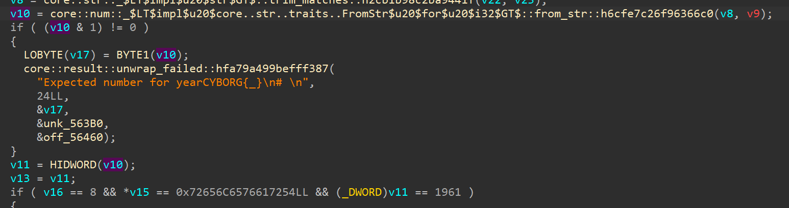

# basic rust rev

author: neonlian

category: rev

## Solution

For this solution, I'll be using IDA Free and analyzing the linux executable. 

Rust executables don't have the `fn main()` function you write in code as the direct entrypoint of the executable. Instead, the `main` 
function is passed as a pointer to a Rust internal function which runs additional code before `fn main()` begins.


To reach the real `main` method, click on the function pointer (the `RevEng::main::h5b61400a72e3245c` text in this case).

The decompiled code is fairly large for only asking for two inputs and printing an output. This is because a lot of the code is 
generated to handle exception cases from calling `.unwrap()` or `.expect()`, and to deallocate memory as variables leave scope.

The critical part of the code is here:
```c++
if ( v16 == 8 && *v15 == 0x72656C6576617254LL && (_DWORD)v11 == 1961 )
{
    v24 = &v14;
    v25 = _$LT$alloc..string..String$u20$as$u20$core..fmt..Display$GT$::fmt::h69b42876f6df0e06;
    v26 = (size_t *)&v13;
    v27 = core::fmt::num::imp::_$LT$impl$u20$core..fmt..Display$u20$for$u20$i32$GT$::fmt::h70cb0cc39cca2353;
    v17 = &off_56478;
    v18 = 3LL;
    v19 = &v24;
    v20 = 2uLL;
    result = std::io::stdio::_print::h47fcac1e810b43ce(&v17);
}
else
{
    v24 = (size_t *)&v13;
    v25 = core::fmt::num::imp::_$LT$impl$u20$core..fmt..Display$u20$for$u20$i32$GT$::fmt::h70cb0cc39cca2353;
    v26 = &v14;
    v27 = _$LT$alloc..string..String$u20$as$u20$core..fmt..Display$GT$::fmt::h69b42876f6df0e06;
    v17 = &off_564A8;
    v18 = 3LL;
    v19 = &v24;
    v20 = 2uLL;
    result = std::io::stdio::_print::h47fcac1e810b43ce(&v17);
}
```

This code is important because it will print out to the console, as indicated by the `std::io::stdio::_print` calls. The branch of code
where the if statement condition is true will print the flag, as `&off_56478` is included in the print formatting which is an offset to the 
flag format string:


The three conditions for the if statement to be true are:
```
v16 == 8 && 
*v15 == 0x72656C6576617254LL && 
(_DWORD)v11 == 1961
```

`v15` is the input string and `v16` is the length of the string, as indicated by this `memcpy` earlier in the program:


`v11` is the input number, since it comes from `v10` and `v10` is unwrapped with an 'Expected number for year' exception error.



To get the input string, we can convert the 0x72656C6576617254LL number to decimal to get 'relevarT'. However, we need to reverse
the string because IDA interpreted the string comparison as a numeric comparison with little-endian bytes when Rust actually stores
the bytes with the first character as the first byte, second character as the second byte, etc.


The input number is 1961 as seen in the if statement condition.

Inputting 'Traveler' and '1961' into the program gives the flag:
```
> ./BasicRustRev
What is your name?
Traveler
Enter a number.
1961
CYBORG{Traveler_1961}
```

## A note on Rust strings
IDA and other decompilers may present strings weirdly, showing many program strings concatenated together in one place when only one
string should be showing.


This is because Rust does not save strings as null-terminated like C does, and instead uses explicit lengths in string operations.