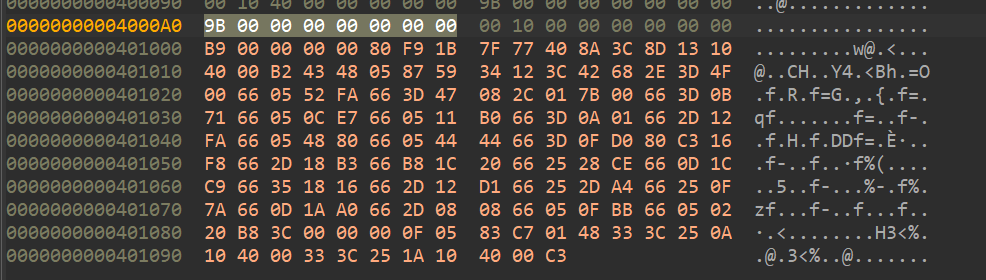
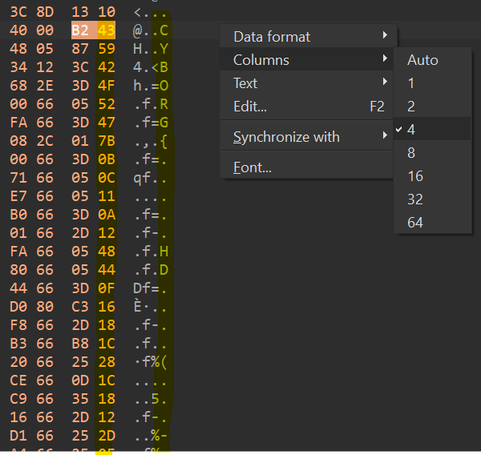
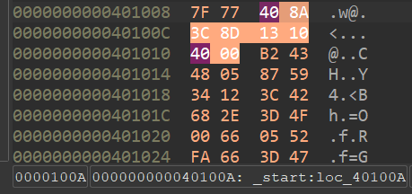
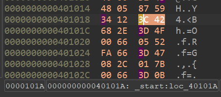

# revachol

author: neonlian

category: rev

## Solution

For this solution I will be using IDA Free.

### Part 1: Status code

If you look at the pseudocode of the executable, it doesn't seem to be doing much:

```c
signed __int64 start()
{
  return sys_exit(*(&loc_401012 + 1));
}
```
All the program does is immediately return with a status code. 
```
> ./revachol
> echo $?
67
```

67 is the ascii code for 'C', which is a clue that it is the beginning of the flag (knowing that the format is `CYBORG{}`)

### Part 2: Finding the pattern in the bytes

Here is the disassembly that IDA generates:
```asm
.text:0000000000401000                 public _start
.text:0000000000401000 _start          proc near               ; DATA XREF: LOAD:0000000000400018↑o
.text:0000000000401000                                         ; LOAD:0000000000400088↑o
.text:0000000000401000                 mov     ecx, 0
.text:0000000000401005                 cmp     cl, 1Bh
.text:0000000000401008                 jg      short kim
.text:000000000040100A
.text:000000000040100A loc_40100A:                             ; DATA XREF: _start+8B↓r
.text:000000000040100A                 mov     dil, byte ptr ds:loc_401012+1[rcx*4] ; error_code
.text:0000000000401012
.text:0000000000401012 loc_401012:                             ; DATA XREF: _start:loc_40100A↑r
.text:0000000000401012                 mov     dl, 43h ; 'C'
.text:0000000000401014                 add     rax, 12345987h
.text:000000000040101A
.text:000000000040101A loc_40101A:                             ; DATA XREF: _start+93↓r
.text:000000000040101A                 cmp     al, 42h ; 'B'
.text:000000000040101C                 push    4F3D2Eh
.text:0000000000401021                 add     ax, 0FA52h
.text:0000000000401025                 cmp     ax, 847h
.text:0000000000401029                 sub     al, 1
.text:000000000040102B                 jnp     short $+2
.text:000000000040102D
.text:000000000040102D loc_40102D:                             ; CODE XREF: _start+2B↑j
.text:000000000040102D                 cmp     ax, 710Bh
.text:0000000000401031                 add     ax, 0E70Ch
.text:0000000000401035                 add     ax, 0B011h
.text:0000000000401039                 cmp     ax, 10Ah
.text:000000000040103D                 sub     ax, 0FA12h
.text:0000000000401041                 add     ax, 8048h
.text:0000000000401045                 add     ax, 4444h
.text:0000000000401049                 cmp     ax, 0D00Fh
.text:000000000040104D                 add     bl, 16h
.text:0000000000401050                 clc
.text:0000000000401051                 sub     ax, 0B318h
.text:0000000000401055                 mov     ax, 201Ch
.text:0000000000401059                 and     ax, 0CE28h
.text:000000000040105D                 or      ax, 0C91Ch
.text:0000000000401061                 xor     ax, 1618h
.text:0000000000401065                 sub     ax, 0D112h
.text:0000000000401069                 and     ax, 0A42Dh
.text:000000000040106D                 and     ax, 7A0Fh
.text:0000000000401071                 or      ax, 0A01Ah
.text:0000000000401075                 sub     ax, 808h
.text:0000000000401079                 add     ax, 0BB0Fh
.text:000000000040107D                 add     ax, 2002h
.text:0000000000401081
.text:0000000000401081                 public kim
.text:0000000000401081 kim:                                    ; CODE XREF: _start+8↑j
.text:0000000000401081                 mov     eax, 3Ch ; '<'
.text:0000000000401086                 syscall                 ; LINUX - sys_exit
.text:0000000000401088
.text:0000000000401088 encrypt:
.text:0000000000401088                 add     edi, 1
.text:000000000040108B                 xor     rdi, qword ptr ds:loc_40100A
.text:0000000000401093                 xor     edi, dword ptr ds:loc_40101A
.text:000000000040109A                 retn
.text:000000000040109A _start          endp ; sp-analysis failed
.text:000000000040109A
.text:000000000040109A _text           ends
.text:000000000040109A
.text:000000000040109A
.text:000000000040109A                 end _start
```

In Linux, the exit code of a program comes from the value of the `rdi` register (or `edi`, `di`, or `dil` which are the lower bits of 
`rdi`) when a `syscall` occurs with `rax=60`. The program performs the syscall at the `kim` label, and the `rdi` register is only modified
at the `mov dil` command at the beginning of the program and in the `xor rdi` command in the `encrypt` function. However, the program never
reaches the `encrypt` function so the return value of 67 was only from `mov dil`.

Looking at the `mov dil` instruction closer:
```
mov dil, byte ptr ds:loc_401012+1[rcx*4]
```
What this does is take the address 0x401012, add 4 times the `rcx` register to the address, and then dereference the calculated pointer to 
store in the `dil` register (which is the lowest 8-bits of the `rdi` register). Note that the 0x401012 address refers to a location within
the revachol binary itself. 

The four times `rcx` combined with the above information about the status code hints at important data occurring every four bytes. If you
increment the value of `rcx` from 0 to other integers, you'll see the flag start to appear:
```
> gdb ./revachol
(gdb) set disassemble-next-line on
(gdb) b _start
Breakpoint 1 at 0x401000
(gdb) run
Starting program: ./revachol

Breakpoint 1, 0x0000000000401000 in _start ()
=> 0x0000000000401000 <_start+0>:       b9 00 00 00 00  mov    $0x0,%ecx
(gdb) stepi
0x0000000000401005 in _start ()
=> 0x0000000000401005 <_start+5>:       80 f9 1b        cmp    $0x1b,%cl
(gdb) set $rcx = 1
(gdb) continue
Continuing.
[Inferior 1 (process 2214) exited with code 0131]
(gdb) print $_exitcode
$1 = 89
```
89 is the ascii code for 'Y', indicating the second character of the CYBORG flag format. 

The following instructions after the `mov ecx` instruction hint that the flag is 28 bytes long, since the first character is shown when `rcx=0` and program will exit immediately if the `cl` byte (part of the `rcx` register) is greater than 27:
```
cmp cl, 1Bh
jg  short kim
```

You could find the rest of the flag bytes by repeating this gdb process, or you could look at the bytes directly in the hexdump of the file:


Formatting this as four columns wide makes it easier to see:


Unfortunately, the flag isn't valid ASCII characters after the `CYBORG{` bytes.
```
43 59 42 4F 52 47 7B 0B 0C 11 0A 12 48 44 0F 16 18 1C 28 1C 18 12 2D 0F 1A 08 0F 02
C  Y  B  O  R  G  {
```

### Part 3: Decrypting the flag

In the assembly code, there is an encrypt function defined:
```
encrypt:
.text:0000000000401088                 add     edi, 1
.text:000000000040108B                 xor     rdi, qword ptr ds:loc_40100A
.text:0000000000401093                 xor     edi, dword ptr ds:loc_40101A
.text:000000000040109A                 retn
```

The encrypt function adds one, xors with the 64-bit / 8-byte value starting at address 0x40100A in the binary, then xors with the 32-bit
/ 4-byte value starting at address 0x40101A. 

Looking at the hexdump, we can find the values at the addresses of interest:


```
0x40100A: 40 8A 3C 8D 13 10 40 00
0x40101A: 3C 42 68 2E
```

With this information, we can write a Python script to decode the remaining bytes.
```python
flag_bytes = [0x43, 0x59, 0x42, 0x4F, 0x52, 0x47, 0x7B, 0x0B, 0x0C, 0x11, 0x0A, 0x12, 0x48, 0x44, 0x0F, 0x16, 0x18, 0x1C, 0x28, 0x1C, 0x18, 0x12, 0x2D, 0x0F, 0x1A, 0x08, 0x0F, 0x02]
# Reverse the order of the XOR bytes here because of little-endian order
xor1bytes = 0x00_40_10_13_8D_3C_8A_40
xor2bytes = 0x2E_68_42_3C

def decode(byte):
    byte ^= xor2bytes
    byte ^= xor1bytes
    byte -= 1
    return byte % 0x100
  
print("CYBORG{", end="")
print("".join([chr(decode(b)) for b in flag_bytes[6:]]))
```

This script gives the flag: `CYBORG{volum37ric_S_cmPresr}`


