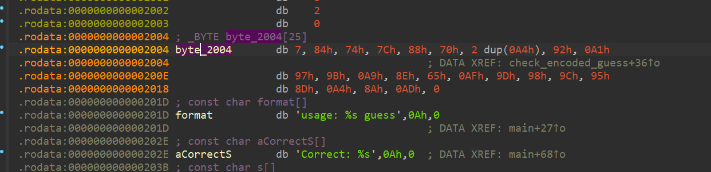
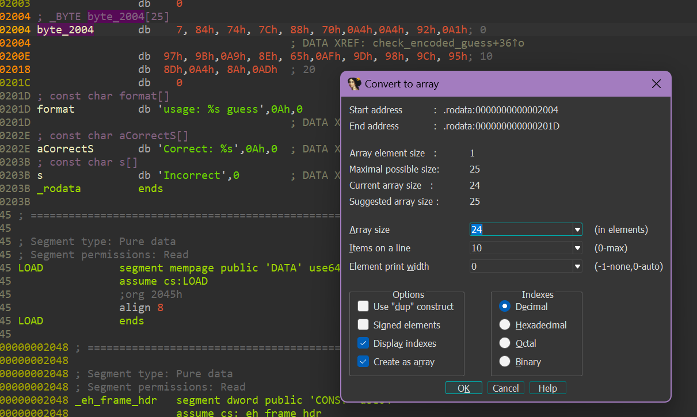
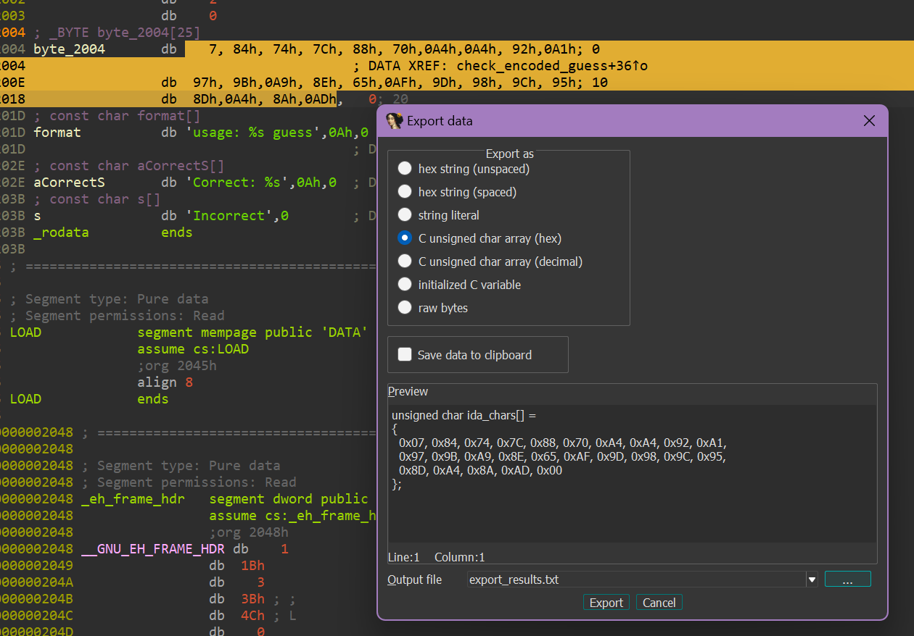

# trynewthings

challenge author: sophisticated.space

category: rev

writeup author: neonlian

## Solution

Open the executable in the reverse engineering tool of your choice. I will use IDA Free for this walkthrough.

Decompiling the code shows that the program accepts a command line argument and print "Correct" if the input is the flag.
```c++
int __fastcall main(int argc, const char **argv, const char **envp)
{
  const char *v4; // [rsp+18h] [rbp-8h]

  if ( argc > 1 )
  {
    v4 = argv[1];
    if ( (unsigned int)check_flag(v4, argv, envp) )
      printf("Correct: %s\n", v4);
    else
      puts("Incorrect");
    return 0;
  }
  else
  {
    fprintf(stderr, "usage: %s guess\n", *argv);
    return 1;
  }
}
```

Looking inside the `check_flag` function, we see it encodes the string parameter and then returns if `check_encoded_guess` is 0.
```c++
_BOOL8 __fastcall check_flag(const char *a1)
{
  __int64 v2; // [rsp+10h] [rbp-20h] BYREF
  void *ptr; // [rsp+18h] [rbp-18h] BYREF
  int v4; // [rsp+24h] [rbp-Ch]
  size_t v5; // [rsp+28h] [rbp-8h]

  v5 = strlen(a1);
  encode(a1, v5, &ptr, &v2);
  v4 = check_encoded_guess(ptr, v2);
  free(ptr);
  return v4 == 0;
}
```

Here is the decompilation of the encode function:
```c++
size_t *__fastcall encode(__int64 a1, size_t a2, _QWORD *a3, size_t *a4)
{
  size_t *result; // rax
  char v7[56]; // [rsp+20h] [rbp-50h] BYREF
  _BYTE *v8; // [rsp+58h] [rbp-18h]
  size_t v9; // [rsp+60h] [rbp-10h]
  size_t i; // [rsp+68h] [rbp-8h]

  v9 = a2;
  v8 = malloc(a2);
  strcpy(v7, "minghsiehdepartmentofelectricalandcomputerengineering");
  v7[54] = 0;
  for ( i = 0LL; i < a2; ++i )
    v8[i] = *(_BYTE *)(a1 + i) + v7[53 - i] - 60;
  *a3 = v8;
  result = a4;
  *a4 = v9;
  return result;
}
```

We can see that the encode function:
* has a string "minghsiehdepartmentofelectricalandcomputerengineering"
* creates a new string `v8` of length `a2` (which is the length of input string `a1`)
* fills in the characters of `v8` using the characters of `a1` with some changes

The line `v8[i] = *(_BYTE *)(a1 + i) + v7[53 - i] - 60;` is equivalent to:
```c++
v8[i] = a1[i] + v7[53 - i] - 60;
```
`a1` is a pointer to a string, and pointer arithmetic is equivalent to array indexing, so `*(_BYTE *)(a1 + i) == a1[i]`.

Knowing the encoding formula allows us to write code to decode a string:
```python
encoded = "????????"
N = len(encoded)
key = b'minghsiehdepartmentofelectricalandcomputerengineering\x00'
decoded = [''] * N
for i in range(N):
    decoded[i] = chr(encoded[i] - key[53 - i] + 60)
```
Note in the decompiled code of `encode` there is the line `v7[54] = 0` appending a null byte at the end of the string. This is reflected in the `\x00` at the end of the key variable in the python script.

What is the encoded string, though? Going to `check_encoded_guess` function called from `check_flag` we get:
```c++
__int64 __fastcall check_encoded_guess(__int64 a1, __int64 a2)
{
  unsigned __int64 i; // [rsp+18h] [rbp-8h]

  if ( a2 != 24 )
    return 0xFFFFFFFFLL;
  for ( i = 0LL; i <= 0x17; ++i )
  {
    if ( *(_BYTE *)(a1 + i) != byte_2004[i] )
      return 0xFFFFFFFFLL;
  }
  return 0LL;
}
```

This code compares the input string to bytes embedded in the binary, represented by `byte_2004`. The if statement at the beginning
of the function checks that the input string is exactly 24 characters. 

Double clicking `byte_2004` in IDA shows the encoded bytes:


It's easiest to view the data by right clicking `byte_2004` > Array:
* Set array size to 24
* Ensure 'Use "dup" construct' is disabled



Next, copy these encoded data bytes into a script to decode the flag. You can copy the bytes of interest by dragging over the byte values and going to Edit > Export data:


Final script:
```python
N = 24
encoded = [0x07, 0x84, 0x74, 0x7C, 0x88, 0x70, 0xA4, 0xA4, 0x92, 0xA1, 
  0x97, 0x9B, 0xA9, 0x8E, 0x65, 0xAF, 0x9D, 0x98, 0x9C, 0x95, 
  0x8D, 0xA4, 0x8A, 0xAD]
key = b'minghsiehdepartmentofelectricalandcomputerengineering\x00'
decoded = [''] * N
for i in range(N):
    decoded[i] = chr(encoded[i] - key[53 - i] + 60)
print("".join(decoded))
```

Flag:
`CYBORG{reverse-viginere}`