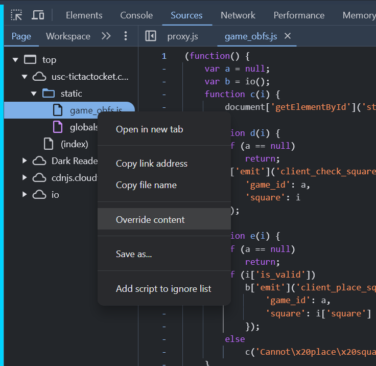
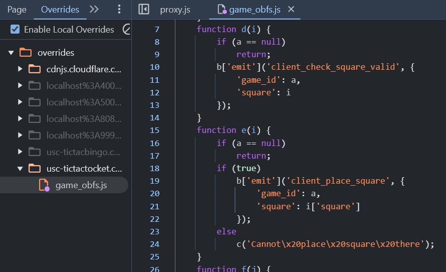
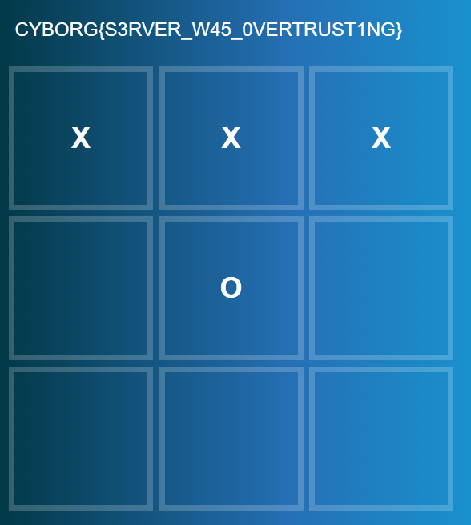

# tictactocket

author: neonlian

category: web

## Solution

To get the flag, you need win the tictactoe game. 

Looking at the network traffic sent (Developer Tools > Network) we can see the game is using the socket.io library (WebSockets) to transmit information to and from the server.
Looking at `game_obfs.js` (Developer Tools > Sources) we can see the names of the socket.io events:
* client_new_game
* server_new_game
* client_check_square_valid
* server_check_square_valid
* client_board_update
* server_board_update

The `h()` function is the main entrypoint for the client code and shows which of the other functions correspond to which socket.io events. 

The `g()` function adds event listeners to each of the squares. When you click a square:
* function `d(i)` is called where `i` is the number corresponding to a square
* The client will emit 'client_check_square_valid' 
* The server will respond with 'server_check_square_valid' which is handled by function `e()`
* `e()` checks if the response contained a true value of 'is_valid', and if so it will send a 'client_place_square' request

The flaw with the program is that the client has the final say on if a place square request can happen, and the server only checks for a valid placement in 'client_check_square_valid' and not 'client_place_square'. 

To take advantage of this, you can override the content of `game_obfs.js` and replace `if (i['is_valid'])` in function `e()` with `if (true)`. This will allow you to send 'client_place_square' requests regardless if the server says a square is valid or not.

Now, after refreshing the page you'll be able to replace the computer's pieces with your own.

## Note

Some people modified the value of 'winner' in the 'server_board_update' handler `f()` which caused the game to print `undefined`. This does not work because the 'winner' value is sent from the server to client to indicate a win, loss, tie, or ongoing game and the server will not send the 'flag' value unless it recognizes a player win on the server side. If the client has no flag information, it cannot print the flag and you get `undefined`. 
